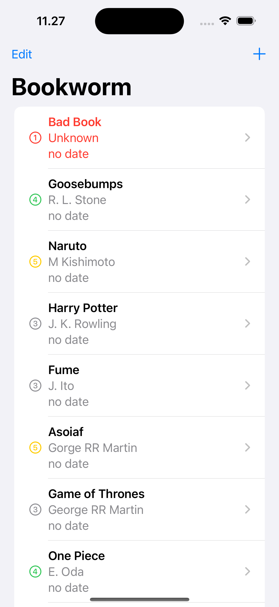
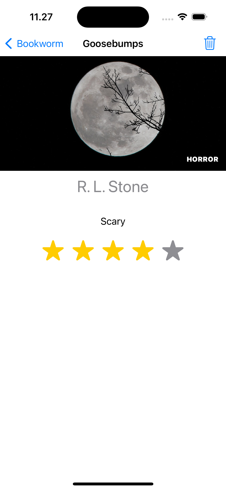
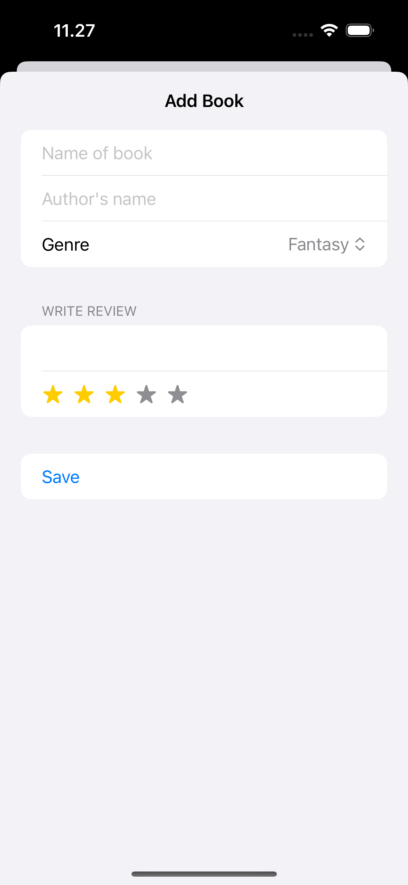

# Bookworm
This is a basic learning project to create an app for tracking the books you’ve read and your thoughts on them. The app displays a list of books with their ratings, allows you to view detailed information about each book, and lets you add new ratings for books.

---
The source learning is from the 11th of course "100 Days of SwiftUI" (https://www.hackingwithswift.com/100/swiftui)

---
## Goals
1. Display a list of books you’ve read, each with its rating.
2. Allow users to tap a book in the list to view detailed information about its rating and review.
3. Include a toolbar button to navigate to a form for adding a new book and its rating.
4. Provide an intuitive interface for viewing and managing your book ratings.
5. Save and persist book information for future reference.

# Bookworm – Image Comments Feature

---
